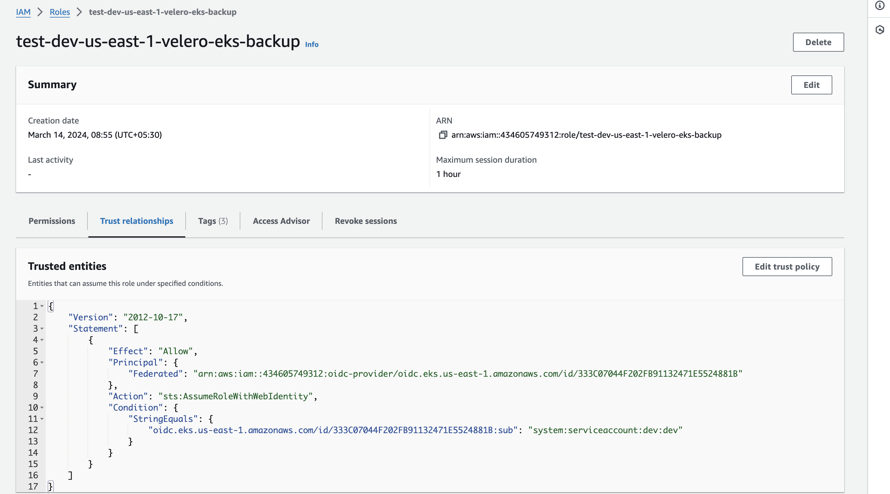

## Versions

1. TF_VERSION = 1.3.9
2. KUBERNETES_VERSION = 1.29
3. AWS_CLI_VERSION = > 2.0.0

##  Outputs:

## Steps to create AWS Eks cluster.

1. Fill  the respective values in the terraform.tfvars
2. terraform init
3. terraform plan
4. terraform apply

1) Fill in Terraform Variables:
Open the terraform.tfvars file.
Fill in the respective values for your AWS environment, including aws_region, cluster_name, instance_type, etc. Ensure all required variables are correctly configured.

2) Initialize Terraform:
Open a terminal or command prompt.
Navigate to the directory containing your Terraform configuration files.
Execute the following command to initialize Terraform and download necessary providers:

terraform init

3) Plan Terraform Execution:
After initializing Terraform, execute a plan to preview the changes that will be applied:

terraform plan

Review the plan output carefully to ensure it aligns with your expectations and requirements. Verify that all resources will be created correctly and that there are no errors or unexpected changes.

4) Apply Terraform Configuration:
Once you've reviewed the plan and are satisfied with the proposed changes, apply the Terraform configuration to create the EKS cluster and associated resources:

terraform apply

Terraform will prompt you to confirm the planned actions. Enter yes to proceed with the execution.
Wait for Terraform to provision the resources. The process may take several minutes, depending on the complexity of your configuration and the AWS infrastructure.

